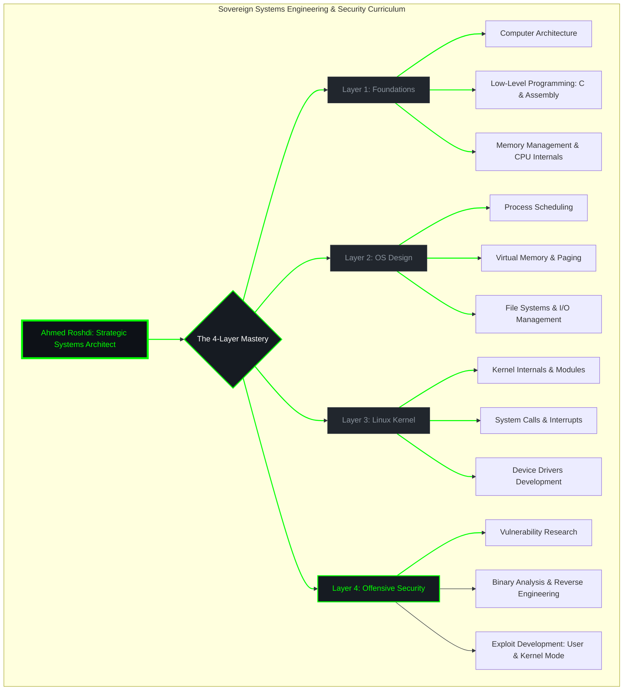

# 🛡️ Ahmed Roshdi | Strategic Systems Architect

  

---

### 🚀 About Me
I approach infrastructure and system design through **Systems Thinking**, focusing on building robust, sovereign architectures from first principles. My mission is to master the depths of the Linux Kernel and contribute to the security of the digital world through deep vulnerability research and offensive security methodologies.

---
<!-- Animated Systems Architecture Banner -->

  

---

### 📊 GitHub Stats & Skills

  
  

  
  
  
  
  

---

### 🏗️ Curriculum Architecture (The 4-Layer Mastery)
Below is the structural representation of my self-directed curriculum, designed for deep mastery of OS Internals and Security.

#### Follow My Learning Journey
https://github.com/users/Ahmed-Roshdi/projects/4/

---

### 🔬 Recent Research & Projects
- **[Low-Level Systems Utilities](https://github.com/Ahmed-Roshdi/C-Systems-Utilities):** A collection of C and Bash tools designed to interact directly with the Linux kernel, focusing on memory management and system calls.
- **[Vulnerability Research Lab]:** Ongoing research into user-mode and kernel-mode exploitation techniques.

---

### 🔗 Connect with Me

  
  

---

  <i>"Building robust, sovereign architectures from first principles."</i>

